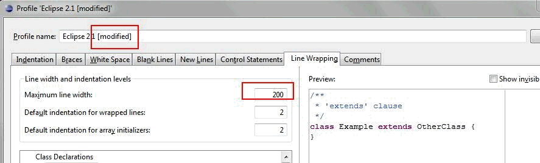

## How to set up in Eclipse
**step 1:  install eclipse and expeditor:** 
    
- Eclipse SDK Ganymede (3.4.2)
- Download link: http://www.eclipse.org/downloads/packages/release/Ganymede/SR2

Install XPD
    
- save Expeditor_Toolkit_Install.zip to local disk → unzip
- start eclipse
- Help - Software Updates - Add Site... point to the Expeditor_Toolkit_Install directory (from above) and install

**step 2:  From Eclipse, import Notes Widgets plugins **
    
- File - Import - existing project - browser to the plugins directory

**step 3. From Eclipse, make the following formatter changes so when we save a file, it will be saved in the same format**

- Window → Preferences -. Java → code Style → Formatter … select “Eclipse 2.1 [built-in]” → Edit … make the following changes:

