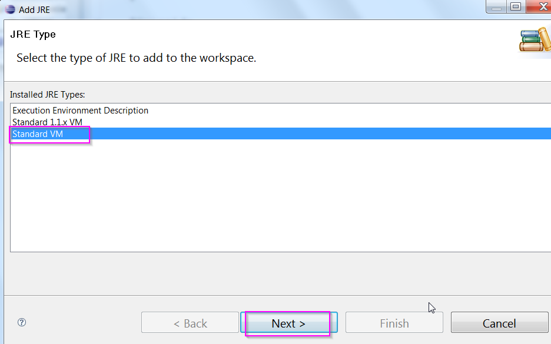

## How to set up in Eclipse
**step 1:  install eclipse and expeditor:** 
    
- Eclipse SDK Ganymede (3.4.2)
- Download link: http://www.eclipse.org/downloads/packages/release/Ganymede/SR2

Install XPD
    
- save Expeditor_Toolkit_Install.zip to local disk → unzip
- start eclipse
- Help - Software Updates - Add Site... point to the Expeditor_Toolkit_Install directory (from above) and install

**step 2:  From Eclipse, import Notes Widgets plugins**
    
- File - Import - existing project - browser to the plugins directory

**step 3. From Eclipse, make the following formatter changes so when we save a file, it will be saved in the same format**

- Window → Preferences -. Java → code Style → Formatter … select “Eclipse 2.1 [built-in]” → Edit … make the following changes:


**step 4. Setup Eclipse configuration:**

- Java




(ignore the “The JRE name is already in use.” msg in the screen shot)


- Plugin


- Client services


**Step 5.  Configure run/debug configurations:**

Run → Debug Configuration... create a new configuration for Client Services:


- Program arguments:

    ```-console -pluginCustomization "${rcp_target}/../plugin_customization.ini"```

- VM arguments:
```
-Declipse.registry.nulltoken=true
-Dosgi.splashPath=platform:/base/../shared/eclipse/plugins/com.ibm.notes.branding
-Djava.util.logging.config.class=com.ibm.rcp.core.internal.logger.boot.LoggerConfig
-Dosgi.framework.extensions=com.ibm.rcp.core.logger.frameworkhook
-Dcom.ibm.pvc.webcontainer.port=0
-Djava.protocol.handler.pkgs=com.ibm.net.ssl.www.protocol
-Dosgi.hook.configurators.exclude=org.eclipse.core.runtime.internal.adaptor.EclipseLogHook,com.ibm.jxesupport.CDSHookConfigurator
"-Xbootclasspath/a:${rcp_base}/rcpbootcp.jar"
-Xss512K
-Xms128m -Xmx384m -XX:MaxPermSize=128m
"-Drcp.data=${rcp_data}"
"-Drcp.home=${rcp_target}/../.."
"-Djava.security.policy=${rcp_target}/../../../java.policy"
```


