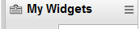
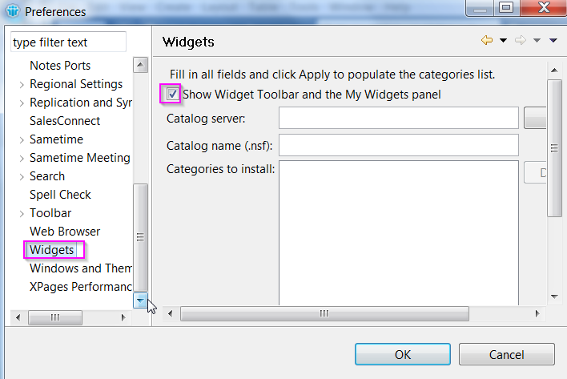

# How to install Notes Widgets:

- For developer or tester, here's a way to install Notes Widgets from a Testing server:Open the following file from browser and save it to local disk / dashtop

https://SugarCRMURL/custom/scrmsugarws/noteswidget/SalesConnectNotesWidget.xml

- Be sure the My Widgets panel is displayed on the Notes client side shelf:



- If you don't see My Widgets panel, go to File – Preferences – Widgets … check the Show Widget Toolbar and the My Widgets panel checkbox:



- Drag and drop the SalesConnectNotesWidget.xml file saved above to My Widgets panel.

## Collecting Log from user:

Following are the steps to collect trace/log from the user:

- Add the following lines to the end of the <Notes_data_dir>/workspace/.config/rcpinstall.properties file 
(MAC:  /Users/username/Library/Application Support/IBM Notes Data/Expeditor/Applications/.config/rcpinstall.properties ):

```
com.ibm.socialcrm.notesintegration.core.level=FINEST
com.ibm.socialcrm.notesintegration.connector.level=FINEST
com.ibm.socialcrm.notesintegration.utils.level=FINEST
com.ibm.socialcrm.notesintegration.ui.level=FINEST
```

- restart Notes client and reproduce the problem

- zip up (compress) <Notes_data_dir>/workspace/logs directory  (MAC /Users/username/Library/Application Support/Lotus Notes Data/Expeditor/Applications/logs directory)

note:  on my MAC, these are the directories: 
- /Users/sclkg/Library/Application Support/Lotus Notes Data/Expeditor/Applications/.config/rcpinstall.properties
- /Users/sclkg/Library/Application Support/Lotus Notes Data/Expeditor/Applications/logs